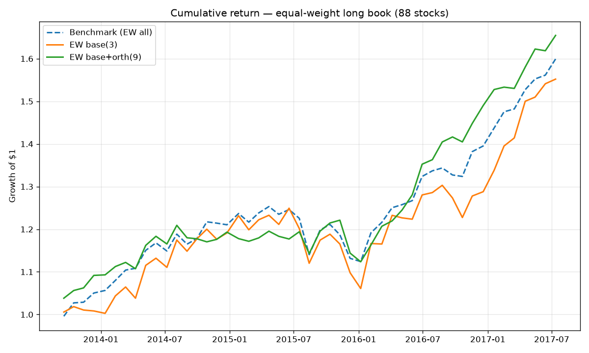

# Multi-Factor Equity Selection — a rigorously backtested study

A cross-sectional, multi-factor stock-selection strategy built end to end:
factor construction → information-coefficient validation → **orthogonalisation** →
strictly walk-forward backtesting → transaction-cost and alpha/beta
decomposition → parameter-robustness sweep.

The emphasis is **process and honesty, not headline returns**. Every result
below is out-of-sample (no look-ahead), and the negative results are reported as
prominently as the positive ones. A companion [`LIMITATIONS.md`](LIMITATIONS.md)
states exactly what this study does and does not establish.

> **Companion project (event-driven, fundamental):**
> [**pead-earnings-alpha**](https://github.com/Kenny030501/pead-earnings-alpha)
> builds a Post-Earnings-Announcement-Drift signal from **point-in-time SEC EDGAR
> filings** and runs it through this same research approach — the independent,
> fundamental alpha source this project's limitations call for.

---

## Key findings (read first)

1. **Simple beats complex.** A sign-only **equal-weight composite** of the
   factors out-performs IC-weighting, ICIR-weighting, Ridge, and gradient-boosted
   trees on a 30–88 name cross-section. Flexible models mostly fit noise on a
   small universe.
2. **The alpha comes from the orthogonal factors, not from beta.** On the
   88-stock universe the three base factors alone have *negative* alpha (they are
   ~1.24× leveraged market beta). Adding the orthogonalised factors flips alpha to
   **+4.4%/yr, beta 0.71, information ratio 0.80** — the source of skill is the
   incremental orthogonal signal.
3. **The alpha is not yet statistically significant.** Its *t*-stat is 1.1–1.5
   (< 2) over ~50 monthly rebalances. The strategy survives realistic transaction
   costs and is stable across parameters, but the sample is too short to claim a
   confirmed edge — see [`LIMITATIONS.md`](LIMITATIONS.md).

---

## Data

| Universe | Names | Period | Source |
|----------|------:|--------|--------|
| Primary | 30 US large caps | 2020-01-02 → 2024-12-30 | yfinance (`data_panel.parquet`) |
| Larger | 88 US names | 2012 → 2017 | StockNet, GitHub-hosted (`data_panel_large.parquet`) |

Daily OHLCV, stored as a long panel (one row per `(date, code)`). The two
universes do not overlap in time and are used as **independent** tests of the
same methodology, not as one pooled sample. Data is OHLCV-only — there are no
fundamentals, which bounds how much truly independent signal can exist.

---

## Methodology

A six-stage pipeline, each stage a small script; `factor_lib.py` holds the
shared, universe-agnostic factor definitions.

**1 — Factors.** Three base price/volume factors (`mom_20`, `rev_5`, `vol_20`),
computed per stock so windows never cross tickers.

**2 — IC validation** (`compute_ic.py`). The relevant question for *selection* is
cross-sectional: on each date, does ranking stocks by the factor rank them by
forward return? Measured by the daily Spearman rank IC vs the forward 20-day
return. On the primary universe only volatility carries a stable signal
(mean IC +0.040), momentum and short reversal are weak — an honest first result.

**3 — Orthogonalisation** (`factor_orthogonal.py`). Seven candidate factors are
each z-scored cross-sectionally, **regressed on the base factors within each
date, and replaced by the residual**, so only the part *not* already explained by
the base set remains. A candidate is kept only if its residual still has a
significant rank IC. This is the methodological centrepiece:

| candidate | raw IC (t) | orthogonal IC (t) | note |
|-----------|-----------:|------------------:|------|
| `illiq_20` (Amihud illiquidity) | −0.067 (−8.3) | **−0.050 (−7.4)** | strongest independent signal |
| `mom_120` (6-month momentum) | +0.045 (+5.1) | **+0.025 (+3.6)** | adds to 20-day momentum |
| `mom_12_1` (12-1 momentum) | +0.038 (+4.2) | **+0.026 (+3.5)** | nearly orthogonal already |
| `hi_52w` (52-week-high proximity) | +0.007 (+0.7) | **+0.032 (+4.5)** | hidden until orthogonalised |
| `max_20` (lottery) | +0.022 (+2.7) | **−0.030 (−5.8)** | flips sign once vol is removed |
| `dvol_20` (downside vol) | +0.027 (+3.5) | +0.019 (+3.3) | kept |
| `skew_60` (return skew) | +0.000 (0.1) | −0.007 (−1.1) | **dropped** |

`hi_52w` looks dead in raw form but has a strong independent signal once its
overlap with momentum/vol is removed; `max_20` reproduces the classic lottery
anomaly only after controlling for volatility (correlation 0.81).

**4 — Walk-forward backtest** (`backtest.py`). At each rebalance the model sees
only factors observable that day and labels whose forward window has already
realised — no look-ahead. Rebalance every 20 trading days, hold 20; equal-weight
the top quintile (long book), long-short = top − bottom quintile; benchmark =
equal-weight universe. Five synthesis models are compared: equal-weight, IC-
weighted, ICIR-weighted, Ridge, and gradient-boosted trees. The base-vs-
orthogonal comparison uses an identical, warm-up-aligned window so it is not
confounded by period.

**5 — Cost & risk decomposition** (`transaction_costs.py`, `report.py`).
Turnover and net-of-cost Sharpe; then a CAPM regression on the benchmark to
separate genuine alpha from market beta.

**6 — Robustness** (`robustness.py`). Sweep book size and horizon to check the
result is not a single lucky parameter choice.

---

## Results

### Backtest — base (3 factors) vs base+orthogonal (9), long book

Both universes use identical, warm-up-aligned windows.

**Primary universe — 30 stocks, 2021–2024:**

| strategy | ann. ret | Sharpe | vol | max DD |
|----------|---------:|-------:|----:|-------:|
| Benchmark (EW all) | 14.6% | 0.82 | 17.8% | −27% |
| EW base | 26.9% | 0.90 | 29.9% | −41% |
| **EW base+orth** | 21.4% | **1.00** | 21.4% | −36% |
| IC-weighted base+orth | 10.8% | 0.42 | 26.0% | −49% |
| ICIR-weighted base+orth | 8.6% | 0.34 | 25.2% | −52% |
| GBR base+orth | 13.1% | 0.58 | 22.6% | −38% |

**Larger universe — 88 stocks, 2013–2017:**

| strategy | ann. ret | Sharpe | vol | max DD |
|----------|---------:|-------:|----:|-------:|
| Benchmark (EW all) | 12.8% | 1.52 | 8.4% | −10% |
| EW base | 12.0% | 1.01 | 11.9% | −15% |
| **EW base+orth** | 13.8% | **1.70** | 8.1% | −8% |
| IC-weighted base+orth | 10.2% | 1.01 | 10.1% | −10% |
| ICIR-weighted base+orth | 10.8% | 1.10 | 9.8% | −11% |
| GBR base+orth | 8.2% | 0.82 | 9.9% | −15% |

- Orthogonal factors lift the equal-weight long Sharpe in **both** universes
  (0.90→1.00 and **1.01→1.70**); on the larger universe the composite beats a
  strong benchmark.
- **Data-driven weighting does not beat equal weight.** ICIR (mean IC / std IC)
  is a genuine improvement over IC-magnitude weighting (88-stock 1.01→1.10, lower
  vol) because it penalises unstable factors — but neither beats the sign-only
  equal weight. With few correlated factors, estimating weights costs more noise
  than it gains.
- **Long-short alpha is weak-to-negative** everywhere: large-cap universes have
  low dispersion, so the edge lives in the long book (and carries market beta).

### Transaction costs

The equal-weight composite turns over ~8×/yr (≈66–70% of the book per monthly
rebalance). Net Sharpe of the base+orth long book:

| cost / side | 30-stock | 88-stock |
|-------------|---------:|---------:|
| 0 bps (gross) | 1.00 | 1.70 |
| 10 bps | 0.91 | 1.45 |
| 20 bps | 0.82 | 1.22 |

The edge survives realistic costs — it is not an artefact of turnover.

### Alpha vs beta (88-stock long book)

| | ann. α | β | α t-stat | info ratio |
|--|--:|--:|--:|--:|
| EW base(3) | −3.5% | 1.24 | −1.11 | −0.61 |
| EW base+orth(9) | **+4.4%** | 0.71 | 1.45 | 0.80 |

The orthogonal factors convert leveraged beta into positive, lower-beta alpha —
but the α *t*-stat (1.45) is **not** significant at 95%.



### Robustness (88-stock EW base+orth, Sharpe)

| top frac \ horizon | 10d | 20d | 40d |
|--------------------|----:|----:|----:|
| top 10% | 1.29 | 1.53 | 1.28 |
| **top 20%** | 1.31 | **1.70** | 1.85 |
| top 30% | 1.26 | 1.67 | 1.84 |

Stable and positive across the grid — the headline number is not cherry-picked.

---

## Repository layout

| File | Role |
|------|------|
| `factor_lib.py` | Shared, universe-agnostic factor + orthogonalisation logic |
| `factor_panel.py` | Build base factors for the primary universe |
| `compute_ic.py` | Rank-IC factor validation |
| `factor_orthogonal.py` | Build & test orthogonal factors → `factor_panel_ext.parquet` |
| `build_universe.py` | Download the 88-stock universe → `factor_panel_large_ext.parquet` |
| `backtest.py` | Walk-forward backtest, 5 synthesis models, base vs base+orth |
| `transaction_costs.py` | Turnover & net-of-cost Sharpe |
| `report.py` | Alpha/beta decomposition + equity-curve plots |
| `robustness.py` | Parameter sweep |
| `LIMITATIONS.md` | Honest statistical / data / methodological caveats |

`*.parquet` are committed data/factor panels; `equity_curve_*.png` are generated
plots. (`panel_data.py`, `factor_momentum.py`, `factor_reversal.py`,
`validate_factor.py`, `train_model.py` are early single-stock scaffolds, kept for
history and superseded by the panel pipeline.)

## How to run

```bash
pip install pandas numpy scikit-learn pyarrow matplotlib

# Primary 30-stock universe
python factor_panel.py
python compute_ic.py
python factor_orthogonal.py
python backtest.py
python transaction_costs.py
python report.py
python robustness.py

# Larger 88-stock universe (same scripts via the PANEL env var)
python build_universe.py
PANEL=factor_panel_large_ext.parquet python backtest.py
PANEL=factor_panel_large_ext.parquet python report.py
```

## Limitations

See [`LIMITATIONS.md`](LIMITATIONS.md) for the full treatment: the alpha is not
statistically significant (t < 2, ~50 periods), IC t-stats are inflated by
overlapping returns, factor selection used full-sample IC, the universes are
small / large-cap / survivorship-biased and span only bull regimes, and the data
is OHLCV-only. The document also lists exactly how each issue would be fixed with
point-in-time, fundamentals-inclusive, multi-regime data.
