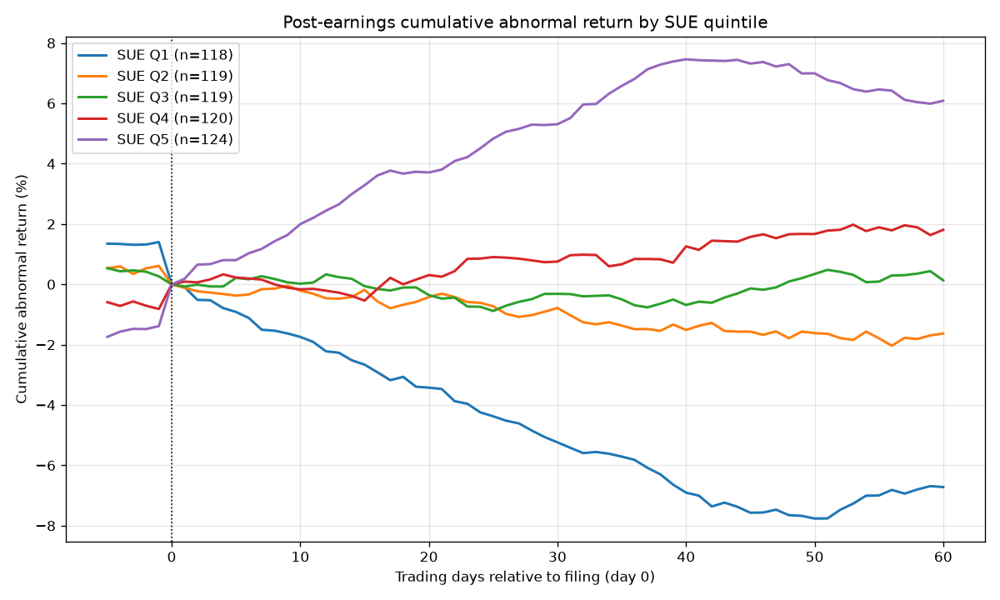

# PEAD — Post-Earnings-Announcement Drift from raw SEC filings

An event-driven **alpha-research** project: build an earnings-surprise signal
from point-in-time SEC EDGAR filings, show it predicts post-announcement drift,
prove it is independent of price/volume factors, and backtest it with the same
rigorous, leakage-free engine as the parent multi-factor project.

This is project 2 of the repo — designed to read as a coherent sequel: project 1
built a factor-research engine on price/volume data; this one points that engine
at a **genuinely different, fundamental, event-driven data source parsed from raw
regulatory filings**.

---

## The alpha hypothesis

Markets **under-react to earnings news**: a stock that reports an earnings
surprise keeps drifting in the surprise's direction for weeks after the
announcement (Ball & Brown 1968; Bernard & Thomas 1989). It is one of the most
robust, persistent anomalies, and the economic story is behavioural — gradual
diffusion of information.

## The signal — SUE (Standardized Unexpected Earnings)

Seasonal-random-walk version, computable from reported EPS alone (no analyst
data needed):

```
unexpected earnings = EPS_q − EPS_{q-4}                    (vs same quarter last year)
SUE = unexpected earnings / std(those YoY diffs, trailing 8q)
```

Two details that matter and are implemented:
- The standardising window is **lagged by one quarter** so the current surprise
  is never in its own scaling denominator (no look-ahead).
- The drift is measured **from the day after filing** — the announcement-day jump
  is the *reaction*; PEAD is the *drift* that follows it.

## Point-in-time integrity (the core claim)

Earnings come from EDGAR's XBRL `companyfacts` API, and every fact carries its
**`filed` date** — the day the number became public. Using `filed` as the event
date guarantees the backtest never sees a figure before the market did. This is
why the project sources raw filings rather than a pre-built fundamentals table.

---

## Pipeline

| Script | Role |
|--------|------|
| `fetch_edgar.py` | **Run on Colab/laptop** — ticker→CIK, pull `companyfacts`, extract quarterly diluted EPS + filing dates (derives Q4 = FY − Q1..3) → `earnings_raw.parquet` |
| `build_sue.py` | EPS history → SUE per event → `sue_panel.parquet` |
| `event_study.py` | CAR by SUE quintile (the headline PEAD fan) + IC decay → `pead_event_study.png` |
| `pead_factor.py` | Daily SUE factor; orthogonalise vs momentum/volatility; rank-IC test → `pead_factor_panel.parquet` |
| `backtest_pead.py` | Walk-forward long-short + long-only, alpha/beta decomposition |
| `make_synthetic.py` | **Verification only** — fabricate data with a *planted* PEAD to prove the pipeline recovers a known effect |

## Status

The pipeline is **verified end-to-end on synthetic data with a planted ~4%/σ
drift** — it recovers a monotonic CAR fan (Q5−Q1 ≈ +13% at +60d), a hump-shaped
IC that peaks near the planted drift length, a SUE rank-IC that survives
orthogonalisation to momentum/volatility, and a positive long-short backtest.

This proves the **code is correct**; it says nothing about whether PEAD is real
in markets. **Real results require running `fetch_edgar.py` to pull actual
filings** (the build sandbox blocks `data.sec.gov`). The synthetic event-study
fan is shown below as a correctness demonstration:



## How to run on real data

```bash
pip install pandas numpy pyarrow matplotlib

# 1) On Colab / your laptop (EDGAR is reachable there). Set CONTACT to your email.
python fetch_edgar.py                      # -> earnings_raw.parquet (real)

# 2) Anywhere. Use the parent project's real price panel for returns:
python build_sue.py
PRICES=../data_panel.parquet python event_study.py
PRICES=../data_panel.parquet python pead_factor.py
python backtest_pead.py
```

To verify the plumbing without any download: `python make_synthetic.py` then run
steps 2 with the default (synthetic) prices.

## Connection to project 1

`pead_factor.py` reuses the parent's z-scoring and orthogonalisation approach and
can be regressed against `../factor_panel_ext.parquet` to show PEAD is orthogonal
to the price/volume factor block — the missing **independent** signal that
project 1's `LIMITATIONS.md` explicitly called for. The combined story: *one
research engine, two orthogonal alpha sources (price/volume + earnings events).*

See [`LIMITATIONS.md`](LIMITATIONS.md) for honest caveats (announcement-date
proxy, Q4 derivation, no analyst expectations, small universe, costs).
